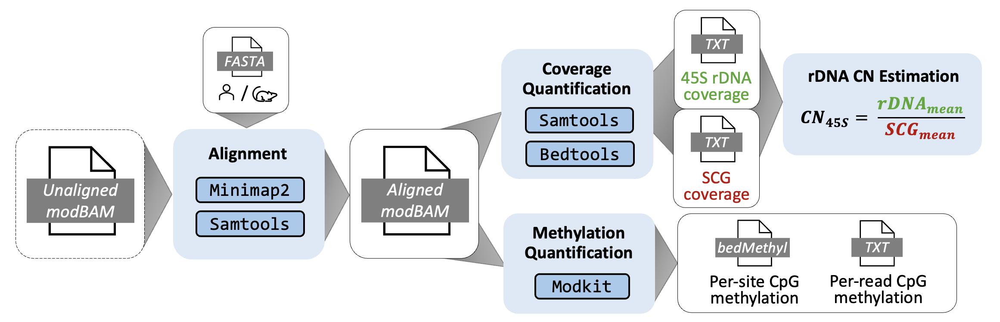

# RICO

RICO (**Ri**bosomal DNA **Co**py number) is a long-read sequencing–based pipeline for estimating **ribosomal DNA (rDNA) copy number (CN)** using coverage normalization against **single-copy genes (SCGs)**, with **DNA methylation analysis**.

The pipeline is designed for **Oxford Nanopore Technologies (ONT)** whole-genome sequencing data and supports both **rDNA CN estimation** and **CpG methylation profiling**.



---

## Overview

RICO performs the following major steps:

1. Alignment of unaligned ONT BAMs to a custom reference genome containing rDNA repeats  
2. Coverage quantification over rDNA loci and curated SCG panel  
3. Estimation of rDNA CN by normalizing rDNA coverage against SCG coverage  
4. Extraction of CpG methylation calls within rDNA regions

The workflow is implemented in *Nextflow (DSL2)* and is optimised for *high-performance computing (HPC)* environments.

---

## Assumptions and current scope

- RICO is currently **designed and tested only on NCI Australia (Gadi)**.
- Job submission uses **PBSPro**.
- Tool paths are specified as absolute paths to ensure reproducibility.
- Reference files must be downloaded separately (see below)

## Tools used in the pipeline
* Nextflow (25.04.6)
* Minimap2 (2.30)
* Samtools (1.23)
* Bedtools (2.31.1)
* Modkit (0.6.1)

---

## Installation

Clone the repository on Gadi:

```
git clone https://github.com/comprna/RICO.git
cd RICO
```

Load Nextflow on Gadi
```bash
module load nextflow/25.04.6
nextflow -version #check
```

### Download reference files (required)

Human and mouse reference genomes and annotation files are available on Zenodo:

DOI: https://doi.org/10.5281/zenodo.18500657

Download the archive and extract:
```
tar -xzf RICO_ref_v1.tar.gz
```

> Place the extracted `ref/` directory inside the cloned RICO repository

RICO currently supports
- Human (GRCh38 + rDNAx5)
- Mouse (GRCm39 + rDNAx5)

## Configure project and storage

Edit `nextflow.config` and update the following fields to match your NCI project:
```bash
process {
  executor = 'pbspro'
  project  = 'jd21' # replace with your NCI project
  storage  = 'gdata/jd21+scratch/jd21+gdata/xc17' # replace with your NCI project
}
```
* project: your NCI project code
* storage: file systems used by the pipeline (where data and results live)

## Inputs

### Unaligned BAMs

Input data are provided via a sample sheet (samples.tsv). 

Example `samples.tsv`:
```bash
file_path
/g/data/xc17/zaka/nextflow/rDNA-CN-pipeline/unaligned_bams/test.bam 
```
> Replace the file path with your file!

## Run the pipeline

### Minimum command (default: human, SCG-2)

From the pipeline directory:
```
nextflow run rico.nf -config nextflow.config --samplesheet samples.tsv
```

The results are written to the `results` folder by default.

But you can specify the results directory using `--results_dir`:
```
nextflow run rico.nf -config nextflow.config --samplesheet samples.tsv --results_dir /path/to/output
```

### Other SCGs for human samples

For human samples, three curated SCG panels are provided: `SCG-1`, `SCG-2` (default), `SCG-3`
Specify using `--scg`, for example:
```
nextflow run rico.nf -config nextflow.config --samplesheet samples.tsv --scg 3
```
If not specified, `SCG-2` is used.


### Mouse samples

```
nextflow run rico.nf --samplesheet samples.tsv --species mouse
```

For mouse samples, it uses a single curated SCG panel only. The `--scg` parameter is ignored when `--species mouse` is selected.

## Outputs

For each input BAM, RICO produces:

**1. Alignment outputs**
* `<sample>_<reference>.bam`
* `<sample>_<reference>.bam.bai`

**2. Copy number estimation**
* Coverage outputs for rDNA and SCGs
* rDNA CN estimates

**3. Methylation outputs**
* BedMethyl file
* Per-read base modification output table for rDNA


