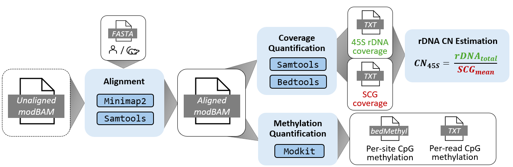

# RICO

RICO (**Ri**bosomal DNA **Co**py number) is a long-read sequencing–based pipeline for **estimating ribosomal DNA (rDNA) copy number (CN)** using coverage normalization against single-copy genes (SCGs), with **DNA methylation analysis**.

RICO is designed for Oxford Nanopore Technologies (ONT) whole-genome sequencing data and supports both rDNA CN estimation and CpG methylation profiling.




## Table of contents
* [Overview](#overview)
* [Running RICO on NCI](#running-rico-on-nci)
* [Running RICO locally](#running-rico-locally)
* [Outputs](#outputs)

---

## Overview

RICO performs the following major steps:

1. Alignment of unaligned ONT BAMs to a custom reference genome containing rDNA repeats  
2. Coverage quantification over rDNA loci and curated SCG panel  
3. Estimation of rDNA CN by normalizing rDNA coverage against SCG coverage  
4. Extraction of CpG methylation calls within rDNA regions

RICO is implemented in *Nextflow (DSL2)* and is optimised for *HPC* environments.

RICO also provides a *standalone bash workflow* (`rico_local.sh`) for users who do not have access to NCI or a Nextflow/HPC environment.

## Running RICO on NCI

RICO is implemented in Nextflow (DSL2).
It is developed and tested on a PBSPro-based HPC system ([NCI Australia](https://nci.org.au/)).

**UPDATE (April 2026):** 
- **RICO now supports execution using Singularity containers**
- **This means all required software dependencies are provided**

The pipeline currently assumes:
- A PBSPro scheduler (executor = 'pbspro')
- HPC-style job submission
- Singularity available on the system (`module load singularity` on Gadi)

Other PBSPro-based HPC systems may work with minimal configuration changes.
Support for `Slurm` or other schedulers has not yet been tested.

### Tools used in the pipeline

RICO was developed and tested with the following versions (bundled in the container image):
* Nextflow (25.04.6)
* Minimap2 (2.30)
* Samtools (1.23)
* Bedtools (2.31.1)
* Modkit (0.6.1)

> When using the Singularity container, manual installation of these tools is no longer required.

---

### Installation

#### 1. Clone the repository on Gadi:

```
git clone https://github.com/comprna/RICO.git
cd RICO
```

#### 2. Load Nextflow and singularity on Gadi

```bash
module load nextflow/25.04.6
module load singularity
nextflow -version #check
```

#### 3. Pull the Singularity container

```bash
mkdir -p /path/to/containers
singularity pull /path/to/containers/rico_2026.03.sif docker://zakayuen/rico:2026.03
```
> Replace `/path/to/containers` with your preferred location (e.g. /g/data/.../containers)

#### 4. Download reference files

Human and mouse reference genomes and annotation files are available on Zenodo:

DOI: https://doi.org/10.5281/zenodo.18500657

Download the archive and extract:
```
tar -xzf RICO_ref_v1.tar.gz
```

> Place the extracted `ref/` directory inside the cloned RICO repository

RICO currently supports
- Human (GRCh38 + rDNAx5)
- Mouse (GRCm39 + rDNAx5)

#### 5. Configure NCI project, storage, and mirror path

Edit `nextflow.config` and update the following fields:
```bash
params {
  project   = 'jd21'
  storage   = 'gdata/jd21+scratch/jd21+gdata/xc17+gdata/qq78'
  container = '/g/data/xc17/zaka/containers/rico_2026.03.sif'
...
```
* project: your NCI project code
* storage: file systems used by the pipeline (where input data and results are stored)
* container: /path/to/containers/rico_2026.03.sif

---

### How to use

#### Input - unaligned BAM

Path to your input BAM needs to be provided in `samples.tsv`:

```bash
file_path
/path/to/your.bam 
```

#### Minimum command (default: human, SCG-2)

From the RICO directory:
```
nextflow run rico.nf \
 --samplesheet samples.tsv
```

The results are written to the `results` folder by default.

But you can specify the results directory using `--out_dir`:
```
nextflow run rico.nf \
 --samplesheet samples.tsv \
 --out_dir /path/to/output
```

#### Other SCGs for human samples

For human samples, three curated SCG panels are provided: `SCG-1`, `SCG-2` (default), `SCG-3`
Specify using `--scg`, for example:
```
nextflow run rico.nf \
 --samplesheet samples.tsv \
 --scg 3
```
If not specified, `SCG-2` is used.

#### Mouse samples

```
nextflow run rico.nf \
 --samplesheet samples.tsv \
 --species mouse
```

For mouse samples, it uses a single curated SCG panel only. The `--scg` parameter is ignored when `--species mouse` is selected.

---

## Running RICO locally 

**UPDATE (May 2026):** 
- **RICO can now be run directly from the command line on a local workstation or server**
- **This reproduces the main RICO workflow without requiring Nextflow or HPC job scheduling**

### Installation

#### 1. Follow steps 1 and 4 from the "Running on NCI" installation section

#### 2. Prepare input samplesheet

Provide paths to unaligned ONT BAM files in `samples.tsv`:

```bash
file_path
/path/to/your.bam 
```

> Make sure your unaligned ONT BAM file contains MM/ML base modification tags.

#### 3. Install tools on your end

The following tools must be installed and accessible on your system:

* Minimap2 (2.30)
* Samtools (1.23)
* Bedtools (2.31.1)
* Modkit (0.6.1)

Edit the tool paths at the following section from `rico_local.sh`.

```
# -------------------------
# Tool paths (replace with your tool paths after installing)
# -------------------------
MINIMAP2="/g/data/xc17/zaka/lib/minimap2-2.30/minimap2"
SAMTOOLS="/g/data/xc17/zaka/lib/samtools-1.23/bin/samtools"
BEDTOOLS="/g/data/xc17/zaka/lib/bedtools-2.31.1/bin/bedtools"
MODKIT="/g/data/xc17/zaka/lib/modkit-0.6.1/modkit"
```

### Running RICO locally

```bash
./rico_local.sh --help

Usage:
  bash rico_local.sh --samplesheet samples.tsv --outdir results [options]

Required:
  --samplesheet FILE       Tab-delimited samplesheet with a file_path column

Options:
  --species human|mouse    Default: human
  --scg 1|2|3              Human SCG panel. Default: 2. Ignored for mouse sample
  --outdir DIR             Default: results
  --threads N              Default: 4
  --sort-mem SIZE          Memory per samtools sort thread. (Default: 2G)
  --force                  Re-run steps even if output files already exist. (Default: false)
  -h, --help               help message

Example:
  bash rico_local.sh --samplesheet samples.tsv --species human --scg 2 --outdir result_sampleX --threads 8
```

#### Default run (human, SCG-2):

```bash
./rico_local.sh \
 --samplesheet samples.tsv 
```

#### Mouse samples

```bash
./rico_local.sh \
  --samplesheet samples.tsv \
  --species mouse \
  --outdir results_mouse \
  --threads 8
```

## Outputs

For each input BAM, both the Nextflow and standalone bash workflows produce:

**1. Alignment outputs**
* `<sample>_<reference>.bam`
* `<sample>_<reference>.bam.bai`

**2. Copy number estimation**
* Coverage outputs for rDNA and SCGs
* rDNA CN estimates

**3. Methylation outputs**
* BedMethyl file
* Per-read base modification output table for rDNA

## Citation

> Yuen, Leeder, Udumanne, Hannan, Eyras & Hein. Accurate estimation of ribosomal DNA copy number using nanopore long-read sequencing. (Manuscript in preparation)
